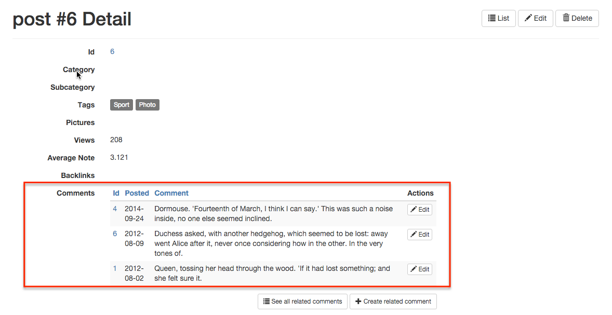
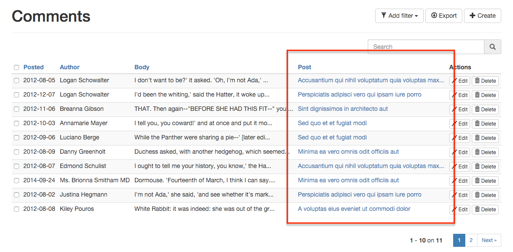
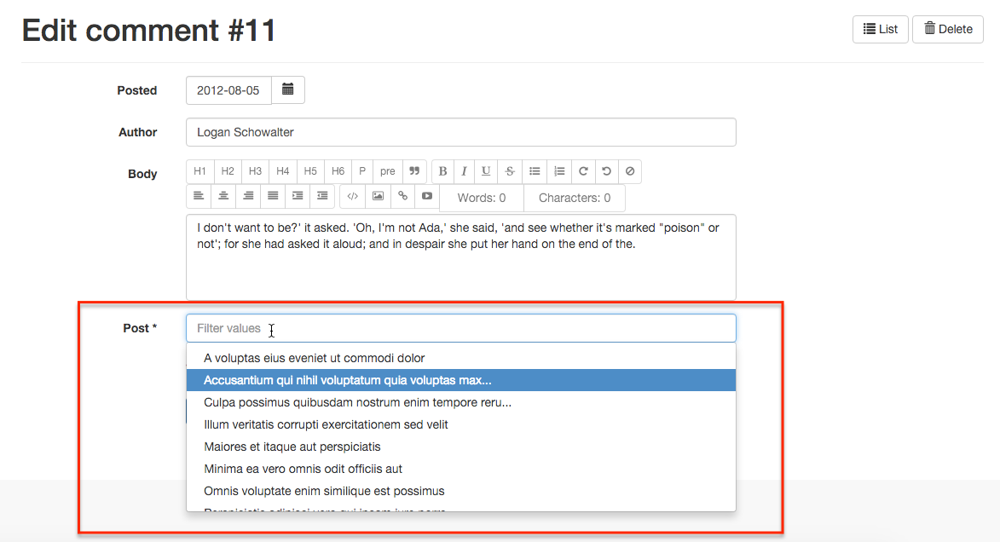
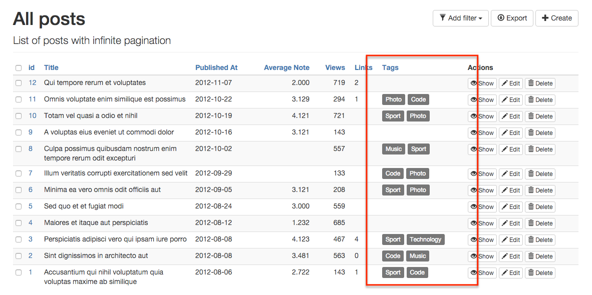
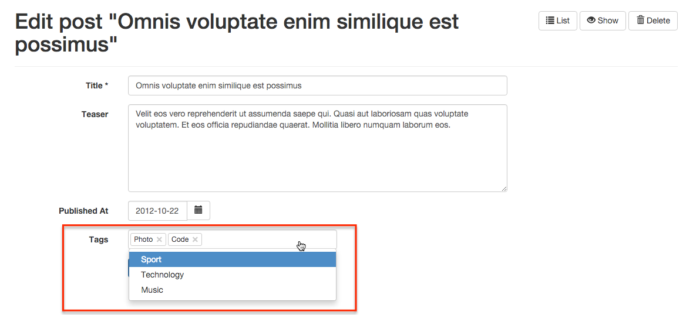
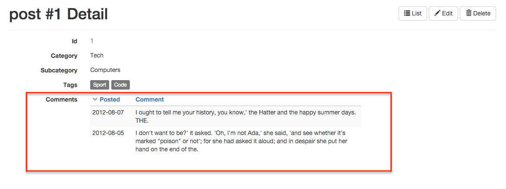
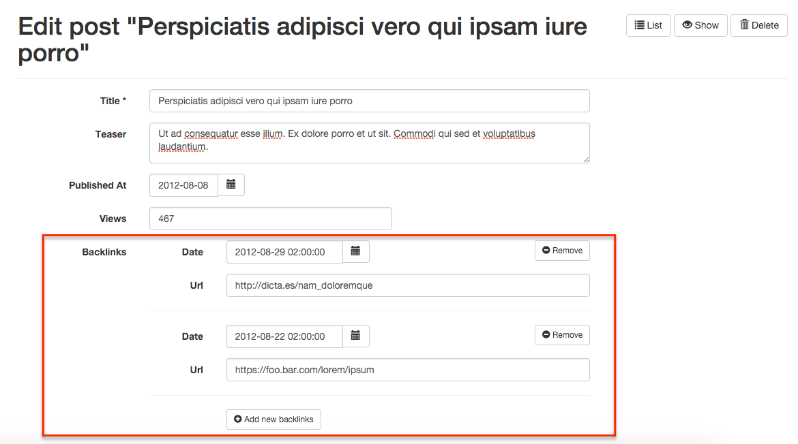
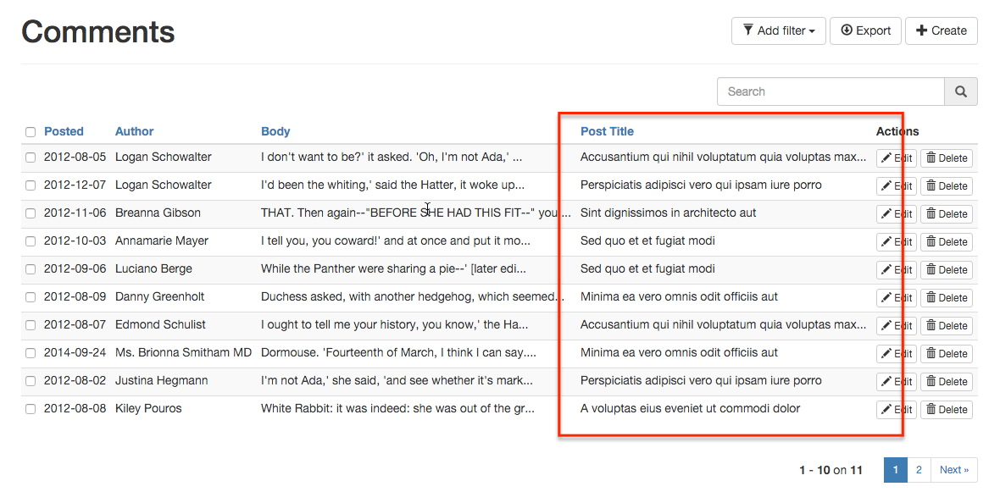

# Mapping Relationships

Mapping a standalone REST endpoint is easy. The tricky part is when the response from a particular endpoint references another endpoint - like foreign keys in a relational database. How can you take advantage of these references in a ng-admin application?

For a simple one-to-many relationship between post and comments, a REST API has three ways to implement the relationship: 
 - using foreign keys,
 - using an array of foreign keys, or
 - using embedded entities.

Ng-admin offers field types for each of these cases. Let's see them in detail.

## Simple Foreign Key

That's the most usual case: the relationship is carried by the `comment` entity, using a `post_id` field referencing a particular `post` entity.

```
GET /posts/456
{
    "id": "456",
    "title": "Consectetur adipisicing elit",
    "body": "Sed do eiusmod..."
}

GET /comments/123
{
    "id": 123,
    "author": "Alice",
    "body": "Lorem ipsum sic dolor amet...",
    "post_id": 456 // foreign key to post of id 456
}
GET /comments/124
{
    "id": 124,
    "author": "Bob",
    "body": "Lorem ipsum sic dolor amet...",
    "post_id": 456 // foreign key to post of id 456
}
```

FKey in comment   | read context      | write context
------------------|-------------------|--------------  
comments for post | `referenced_list` | N/A
post for comment  | `reference`       | `reference`

When displaying a post:

* Use the [`referenced_list` type](reference/Field.md#referenced_list-field-type) to show the comments related to a post in a `showView` or an `editionView`.

        post.showView().fields([
            //...
            nga.field('comments', 'referenced_list') // display list of related comments
                .targetEntity(nga.entity('comments'))
                .targetReferenceField('post_id')
                .targetFields([
                    nga.field('id'),
                    nga.field('created_at').label('Posted'),
                    nga.field('body').label('Comment')
                ])
                .sortField('created_at')
                .sortDir('DESC')
                .listActions(['edit']),

        ])



* Ng-admin doesn't provide the ability to add or remove comments to a post in the post `editionView`. It must be done on the comment `editionView`.

When displaying a comment:

* Use the [`reference` type](reference/Field.md#reference-field-type) to show the post related to a comment in a `listView` or `showView`.

        comment.listView().fields([
            // ...
            nga.field('post_id', 'reference')
                .isDetailLink(false)
                .label('Post')
                .targetEntity(post)
                .targetField(nga.field('title').map(truncate))
                .singleApiCall(ids => ({'id': ids }))
        ])



* Use the [`reference` type](reference/Field.md#reference-field-type) to let users choose the related post in a `creationView` or an `editionView`.

        comment.editionView().fields([
            // ...
            nga.field('post_id', 'reference')
                .label('Post')
                .targetEntity(post)
                .targetField(nga.field('title').map(truncate))
                .sortField('title')
                .sortDir('ASC')
                .validation({ required: true })
                .remoteComplete(true, {
                    refreshDelay: 200,
                    searchQuery: search => ({ q: search })
                })
        ])



## Array Of Foreign Keys

The relationship is sometimes carried by the other side. Let's use a slighlty different example this time: the `post` entity contains a list of `tag` ids referencing a list of `tag` entities:

```
GET /posts/456
{
    "id": "456",
    "title": "Consectetur adipisicing elit",
    "body": "Sed do eiusmod...",
    "tags": [67, 98]
}

GET /tags/67
{
    "id": 67,
    "name": "Sport"
}
GET /tags/98
{
    "id": 98,
    "name": "Photo"
}
```

array of FKeys in post | read context     | write context
-----------------------|------------------|-------------  
tags for post          | `reference_many` | `reference_many`
post for tag           | N/A              | N/A

* Use the [`reference_many` type](reference/Field.md#reference_many-field-type) to show the tags related to a post in a ` listView`, a `showView`, or an `editionView`.

        post.listView().fields([
            // ...
            nga.field('tags', 'reference_many')
                .targetEntity(nga.entity('tag'))
                .targetField(nga.field('name'))
                .singleApiCall(ids => ({'id': ids }))
        ])



* Use the [`reference_many` type](reference/Field.md#reference_many-field-type) to add or remove tags to a post in the post `editionView`.

        post.editionView().fields([
            // ...
            nga.field('tags', 'reference_many')
                .targetEntity(nga.entity('tag'))
                .targetField(nga.field('name'))
                .attributes({ placeholder: 'Select some tags...' })
                .remoteComplete(true, {
                    refreshDelay: 300 ,
                    searchQuery: search => ({ q: search })
                })
        ])



When displaying a tag:

* Ng-admin doesn't provide the ability to show the post related to a tag in a `listView` or `showView`.
* Ng-admin doesn't provide the ability to let the user choose the related post in a `creationView` or an `editionView`.

**Note**: APIs often use arrays of foreign keys to render a many-to-many relationship (the other side of the relationship can also contain an array of foreign keys).

## Embedded Entities

APIs sometimes render a one-to-many relationship by embedding the related entries in the main entry:

```
GET /posts/456
{
    "id": "1",
    "title": "Consectetur adipisicing elit",
    "body": "Sed do eiusmod...",
    "comments": [
        {
            "date": "2014-09-24",
            "body": "Lorem ipsum sic dolor amet...",
        },
        {
            "date": "2012-08-09",
            "body": "Lorem ipsum sic dolor amet...",
        }
    ]
}
```

array of entities in post | read context     | write context
--------------------------|------------------|-------------  
comments for post         | `embedded_list`  | `embedded_list`
post for comment          | N/A              | N/A

When displaying a post:

* Use the [`embedded_list` type](reference/Field.md#embedded_list-field-type) to show the comments related to a post in a `showView`.

        post.showView().fields([
            // ...
            nga.field('comments', 'embedded_list') // Define a 1-N relationship with the (embedded) comment entity
                .targetFields([ // which comment fields to display in the datagrid / form
                    nga.field('date', 'date').label('Posted')
                    nga.field('body')
                ])
        ]);



* Use the [`embedded_list` type](reference/Field.md#embedded_list-field-type) to add or remove comments to a post in the post `creationView` or `editionView`.

        post.editionView().fields([
            // ...
            nga.field('comments', 'embedded_list') // Define a 1-N relationship with the (embedded) comment entity
                .targetFields([ // which comment fields to display in the datagrid / form
                    nga.field('date', 'date').label('Posted')
                    nga.field('body')
                ])
        ]);



## Embedded entity

APIs may render a many-to-one relationship by embedding the related entry in the main entry:

```
GET /comments/123
{
    "id": 123,
    "author": "Alice",
    "body": "Lorem ipsum sic dolor amet...",
    "post": {
        "id": "456",
        "title": "Consectetur adipisicing elit",
        "body": "Sed do eiusmod...",
    }
}
```

When displaying a comment, use the dot notation to show the post related to a comment in any view (works in `listView`, `showView`, `creationView`, and `editionView`):

```
comment.listView().fields([
    nga.field('date').label('Posted'),
    nga.field('author'),
    nga.field('body'),
    nga.field('post.title'), // dot notation
])
```



The inlined post fields renders the same as other comment fields.

entity in comment | read context | write context
------------------|--------------|-------------  
comments for post | dot notation | dot notation
post for comment  | N/A          | N/A
