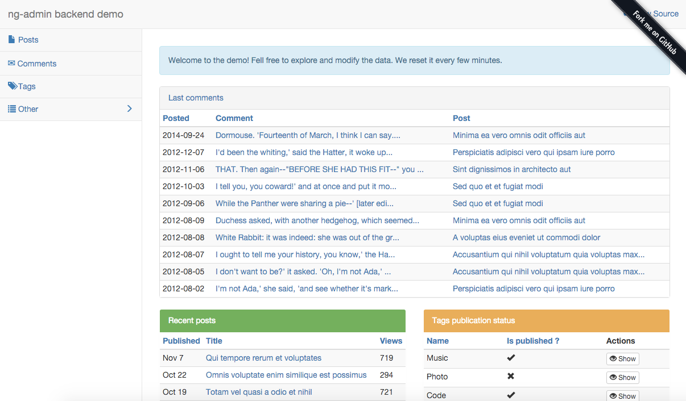
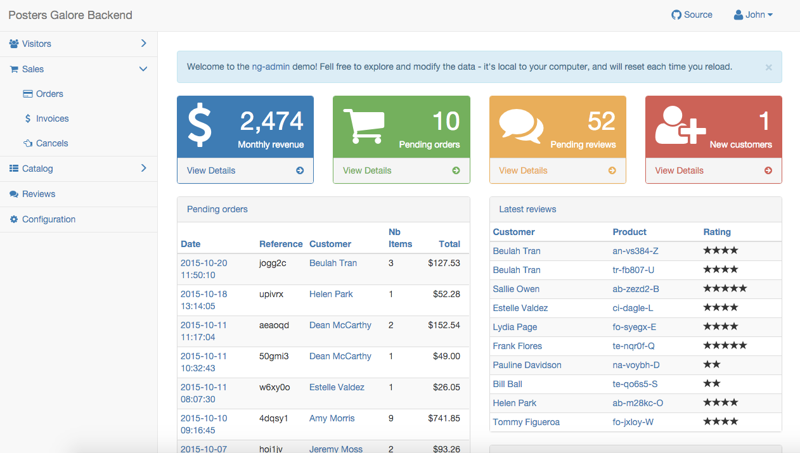

# Usage Examples

* The [blog admin demo](examples/blog/config.js) is a basic, single file configuration. The model is simple: posts, comments, and tags entities. The remote REST API is simulated in the browser, using [FakeRest](https://github.com/marmelab/FakeRest).

* The [Posters Galore demo](http://marmelab.com/ng-admin-demo/) ([source](https://github.com/marmelab/ng-admin-demo)) is a more complete example. It simulates an e-commerce administration for a poster shop. The administration manages visitors, sales, the poster catalog, and reviews.

  The code respects the best coding practices: ES6, independent modules, bundling and minification via WebPack. You will find custom authentication, custom actions, custom directives, and custom pages. The remote REST API is also simulated in the browser, using [FakeRest](https://github.com/marmelab/FakeRest).

If you have a public administration based on ng-admin, please open a Pull Request on this page to showcase your work!
